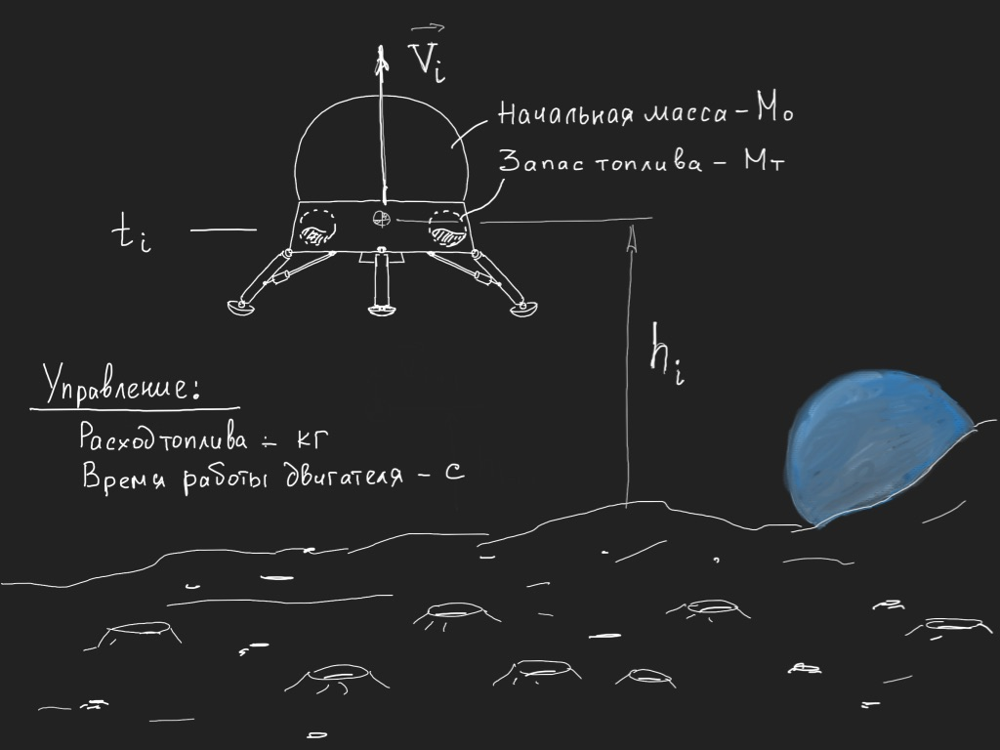

Космический корабль в начальный момент времени находится на высоте $$h$$ от поверхности Луны.

Программа выводит высоту полета, скорость (со знаком плюс или минус) и массу оставшегося топлива:

~~~
--------------------
Время     :  20 c
Высота    :  1063 м
Скорость  : -10.3 м/с
Топливо   :  100 кг
Масса КА  :  1000 кг
--------------------
Введите массу топлива и время работы двигателя:
~~~

Корабль управляется при помощи задания расхода топлива за заданное время, т.е. необходимо ввести через запятую или пробел два числа: количество топлива и время его расходования, например, 50 кг за 5 секунд:

~~~
50 5
~~~

По умолчанию тяга двигателя корабля направлена вверх. Если необходимо направить силу тяги вниз, то необходимо перед массой топлива написать символ "-"

~~~
-50 5
~~~

Перегрузка корабля при работе двигателя не должна превышать предельного значения - 5 единиц. Если перегрузка превысит это значение, то считается, что корабль остается неуправляемым в течение 10 секунд.

Необходимо посадить корабль на поверхность Луны со скоростью не более 3 м/с, имея ограниченный запас топлива на борту.

После окончания игры (посадки) программа должна выводить график изменения скорости и высоты c указанием интервалов манёвров и расхода топлива на каждый маневр.

## Модель движения

Пусть в момент времени $$t_i$$ посадочный модуль имеет скорость $$v_i$$ и находится на высоте $$h_i$$ от поверхности Луны. Тогда после расходования $$\Delta m$$ кг топлива за $$\Detla t$$ секунд, т.е. через $$t_{i+1} = t_{i} + \Delta t$$ высота посадочного модуля над поверхностью Луны будет определяться:

$$
  h_{i+1} = h_i - \frac{g \Delta t^2}{2} + \cdot u \ln \left(1 - \Delta m/m_i \right) \Delta t + u \Delta t + \cdot v_i \Delta t + \frac{m_i}{\Delta m} u \ln (1-\Delta m/m_i) \Delta t
$$

где $$g$$ -- ускорение свободного падения на Луне, $$u \approx 3000$$ м/с - скорость истечения продуктов сгорания двигателя.   

Скорость:

$$
  v_{i+1} = v_i - g \Delta t - 2 u \text{atanh}\frac{\Delta m}{\Delta m - 2 m_i}  
$$

Масса:

$$
  m_{i+1} = m_i - \Delta m
$$

Ускорение посадочного модуля в процессе работы двигателя

$$
  a_i = \frac{\Delta m \cdot u}{\Delta t \cdot m_i \cdot g}
$$

