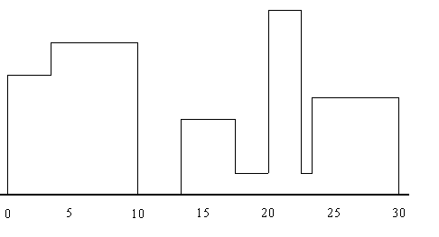

 [Источник](http://algolist.manual.ru/olimp/geo_prb.php)

Необходимо написать программу - помощник архитектора в рисовании очертания города. Город задается расположением зданий. Город рассматривается как двумерный и все здания в нем - прямоугольники, имеющие одинаковое основание (город построен на равнине). Здания задаются тройкой чисел

~~~
(L[i],H[i],R[i])
~~~
где L[i]~ и R[i] есть координаты левой и правой стен здания i, а H[i] - высота этого здания. На рисунке здания описываются тройками

~~~
(1,11,5), (2,6,7), (3,13,9), (12,7,16), (14,3,25), (19,18,22), (23,13,29),(24,4,28)
~~~

Контур, показанный на втором рисунке, задается последовательностью

~~~
(1,11,3,13,9,0,12,7,16,3,19,18,22,3,23,13,29,0)
~~~

1. Ввод представляет собой последовательность троек, задающих дома.
1. Все координаты есть целые числа, меньшие 10000.
1. Во входном файле минимум одно и максимум 50 зданий.
1. Каждая тройка, обозначающая здание находится в отдельной строке во входном файле.
1. Все целые числа в тройке разделены одним или несколькими пробелами.
1. Тройки отсортированы по L[i], т.е. по левой х-координате здания, таким образом, здание с самой маленькой левой х-координатой является первым во входном файле.
1. Вывод будет состоять из вектора, описывающего очертание, как показано в примере выше.
1. В векторе очертания

~~~
(v[1],v[2],v[3], ... , v[n-2],v[n-1],v[n]),
~~~

v[i], когда i-четное число, означает горизонтальную линию (высоту). Когда i-нечетное, v[i]-означает вертикальную линию (х-координату). Последний элемент в векторе линии контура будет 0.
